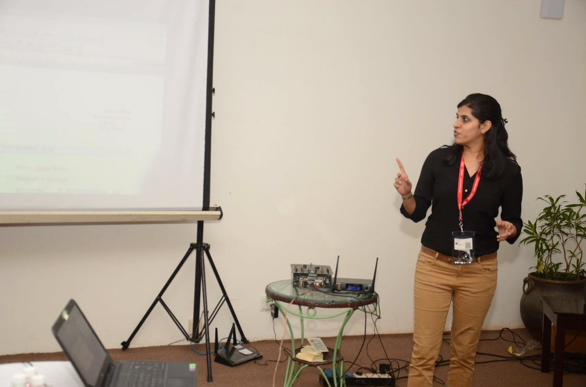

---
layout: post
title: 'Archives of the Social Engineering Village Nullcon'
description: "Social Engineering Village Nullcon 2016"
category: archives
modified: 2018-03-16
permalink: /archives/sev-2016
comments: false
share: false
---	

## *Social Engineering Village Nullcon 2016*

When: 11th March, 2016 
Where: Nullcon 2016, Bogmallo Beach Resort, Goa 

 This archive is a collection of media and resources from previous years of SE Village and CTF at Nullcon.  
 Refer to Resources page for extra bits on Social Engineering and other recommended sources of tools, case studies and further information. 

 

   

<table style="width:60%" border="0">
  <tr>
    <td></td>
    <td> Talks at the Social Engineering Village, Nullcon 2016     
        This was the first year of the SE Village at Nullcon. The SE Capture the Flag event was running parallel to the talks. The Coral @ Bogmallo was overflowing with participants and SE enthusiasts.    
      </td>
  </tr>

</table>

   

