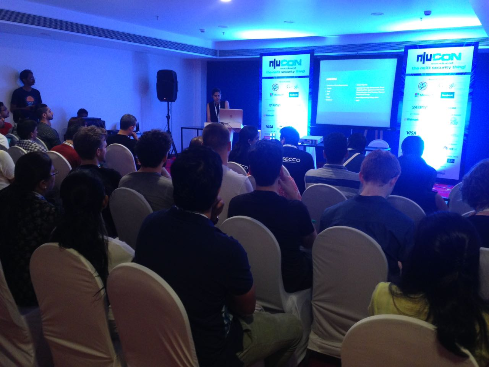
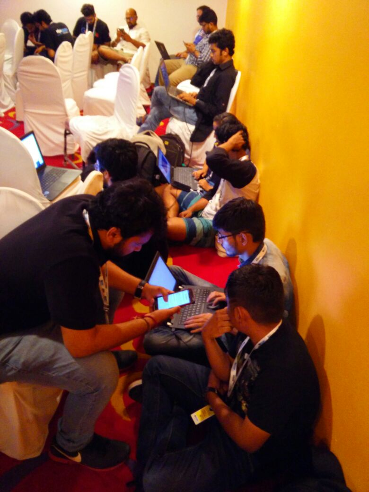

---
layout: post
title: 'Archives of the Social Engineering Village Nullcon'
description: "Social Engineering Village Nullcon 2017"
category: archives
modified: 2018-03-16
permalink: /archives/sev-nullcon-2017
comments: false
share: false
---	

## *Social Engineering Village Nullcon 2017*

When: 4th March, 2017 
Where: Nullcon 2017, Holiday Inn, Goa 

This archive is a collection of media and resources from previous years of SE Village and CTF at Nullcon. Refer to Resources page for extra bits on Social Engineering and other recommended sources of tools, case studies and further information.

 

     

<table style="width:60%" border="0">
  <tr>
    <td></td>
    <td> Talks at the Social Engineering Village, Nullcon 2017     </td>
  </tr>

  <tr>
    <td></td>
    <td> Audience sharing experiences at the SE Village, Nullcon 2017     </td>
  </tr>

    <tr>
    <td></td>
    <td> Participants in the final round of SECTF at the Social Engineering Village, Nullcon 2017     </td>
  </tr>
</table>

   

