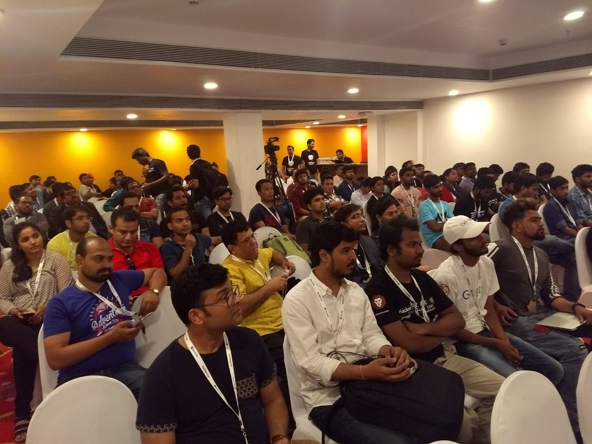
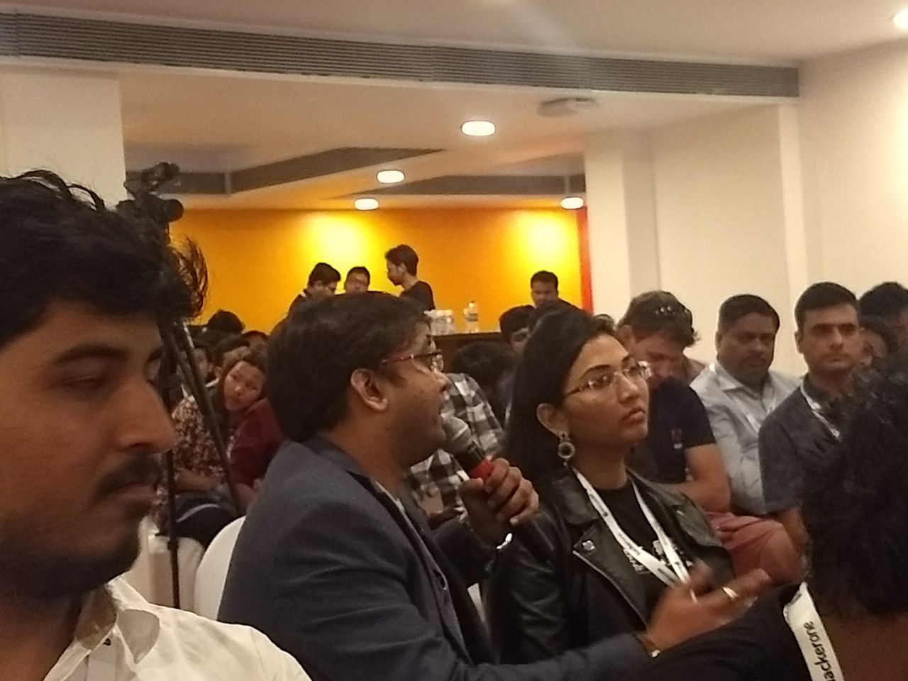
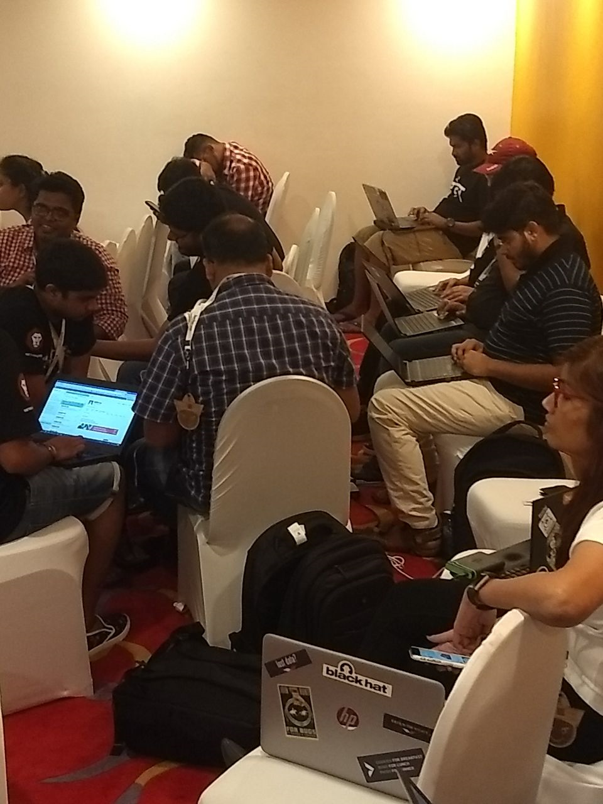
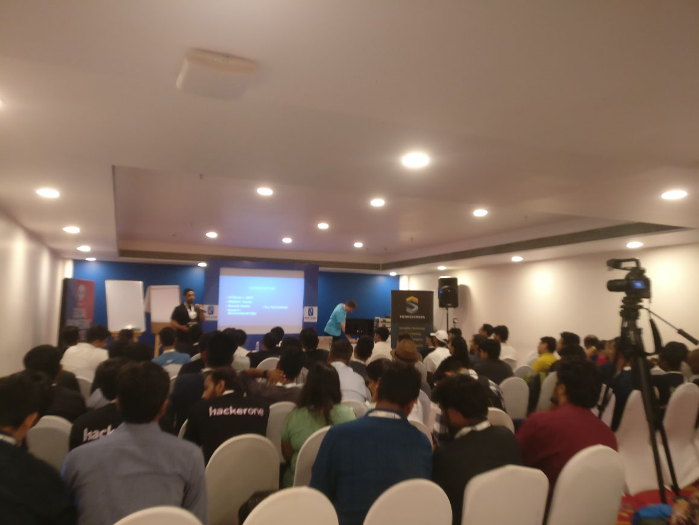

---
layout: post
title: 'Archives of the Social Engineering Village Nullcon'
description: "Social Engineering Village Nullcon 2018"
category: archives
modified: 2018-03-16
permalink: /archives/sev-nullcon-2018
comments: false
share: false
---	

## *Social Engineering Village Nullcon 2018*

When: 2nd & 3rd March, 2018 
Where: Nullcon 2018, Holiday Inn, Goa 

This archive is a collection of media and resources from previous years of SE Village and CTF at Nullcon. Refer to Resources page for extra bits on Social Engineering and other recommended sources of tools, case studies and further information.

 

     

<table style="width:60%" border="0">
  <tr>
    <td></td>
    <td> Audience at the Social Engineering Village, Nullcon 2018     </td>
  </tr>

  <tr>
    <td></td>
    <td> Professionals sharing experiences at the SE Village, Nullcon 2018     </td>
  </tr>

  <tr>
    <td></td>
    <td> SECTF at the Social Engineering Village, Nullcon 2018     </td>
  </tr>
  <tr>
    <td> Talks at the Social Engineering Village, Nullcon 2018     </td>
    <td></td>
  </tr>

</table>

   

