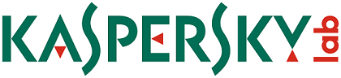

<h1>Sponsors For Social Engineering Village, NullCon 2018</h1>
 

With the advent of information overload and human involvement in corporate decision making, social engineering has become a practical threat. The social engineering village is an attempt to spread awareness regarding the dangers of this and promote proactive defences around this prevalent attack technique. 

> We proudly announce our Sponsors who helped further the cause and awareness for the Village

 

<u><a href='https://www.smokescreen.io/'>smokescreen.io</a></u>

 
 

<table style="width:50%" align="center">
	<tr>
		<td></td>                    
		<td></td>
	</tr>
	<tr>
		<td>
<u><a href='https://www.dnif.it/'>dnif.it</a></u>
</td>
	                                                    
		<td>
<u><a href='https://www.kaspersky.co.in/'>kaspersky.co.in</a></u>
</td>		
	</tr>
</table>

 
 
 

For sponsorship oppotunities <u><a href='mailto:sevillagenullcon@gmail.com'>Contact</a></u> SE Village

